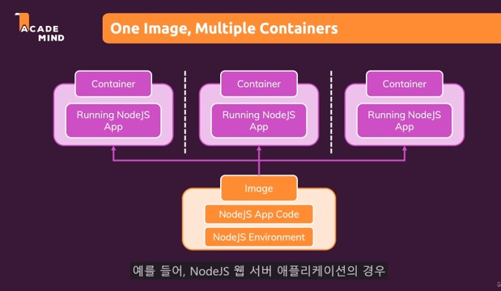

1. Docker 를 사용하는 이유
- 동일한 환경
- 개발팀원들이 동일한 환경에서 개발할수 있음
- 프로젝트 update 시 환경을 re building 하는게 쉬워짐


2. Docker 기본 실행
 1) Dockerfile 작성
 2) Docker image 만들기
 > docker build .
 3) Docker 실행 
 > docker run -p {port}:{port} {docker image id}
 > docker run -p 3000:3000 ab6434f572f6d618abe21cc69da4de6235d98f3a888be41c6142fc81859f1711

 4) Docker Process 확인
 > docker ps

 결과
 ```
  E:\3.edu 교육\edu_docker>docker ps -a
  CONTAINER ID   IMAGE          COMMAND                  CREATED              STATUS                      PORTS                    NAMES
  af1508eb39b7   node           "docker-entrypoint.s…"   About a minute ago   Exited (0) 57 seconds ago                            romantic_johnson
  bc37edd2e2f7   ab6434f572f6   "docker-entrypoint.s…"   18 hours ago         Up 18 hours                 0.0.0.0:3000->3000/tcp   condescending_nobel
 ```
 5) Docker Stop
 >docker stop {name}
 >docker stop condescending_nobe

##2일차
 3.Image & Containers

  
  

 4. Docker hub
  - 'docker run node' 실행 시 local에는 node image 가 없어 docker hub에서 image 를 download 받아서 실행
  - 'docker ps -a' 실행시 node가 image로 실행되었고 status를 보면 Exited 될것을 알수있음.
  - 'docker run -it node' 실행시 인터렉션 할수 있고 node -v 으로 verstion을 확인하면, local과 다른 node 버전을 확인할수 있다.
   > 이것의 의미는 docker로 시스템에 node 설치 없이, 새로운 node를 실행할수 있다는것!!

결과 (docker run node)
```
Unable to find image 'node:latest' locally
latest: Pulling from library/node
1339eaac5b67: Pull complete
4c78fa1b9799: Pull complete
14f0d2bd5243: Pull complete

```

5. Docker File 만들기

```dockerfile
FROM node  --> node를 기반으로 만든다.

WORKDIR /app --> docker 에게 모든 후속명령이 /app 폴더에서 실행되도록 한다.

COPY . ./   --> ./ 는 현제 작업 directory(/app을 의미)
COPY . /app --> 현재 docker 가 포함된 root의 소스를 docker의 /app 에 복사한다.
                (명령어가 /app 폴더에서 이뤄져야 하기때문에 WORKDIR 을 /app으로 설정)

RUN npm install -->기본적으로 docker의 root에서 명령어가 실행되지만,
                   WORKDIR을 /app으로 설정했기때문에 /app에서 명령어가 실행됨

EXPOSE 80

CMD node server.js --> CMD RUN 차이는, 이미지가 생성될때 실행되지 않고, 이미지를 기반으로, 컨테이너가 생성될때 실행
                       (RUN은 이미지가 실행될때 실행)
                       (image를 만들때 npm install을 하지만 컨테이너가 실행될때 server를 구동해야되기때문에 CMD) 
```

6. Image 레이어

- FROM 부터 Image 레이어를 쌓아서 최종 Image를 만든다.
- 단계별로 cache를 하기 때문에 변경사항이 없다면 그대로 진행한다. 
   (단, 변경 사항이 있는 레이어 부터는 다시 build 한다.)

- 최적화 : 코드 변경이 있다면, COPY 부터 build 하겠지만,  
  package json COPY --> npm install -> 모든 파일 복사  순서대로 한다면, 
  소스만 변경된 경우 npm install 은 실행되지 않는다.

기본 File
```dockerfile
FROM node

WORKDIR /app

COPY . /app

RUN npm install

EXPOSE 80

CMD ["node", "server.js"]
```

최적화 File
```dockerfile
FROM node

WORKDIR /app

COPY package.json /app 

RUN npm install

COPY . /app

EXPOSE 80

CMD ["node", "server.js"]
```

7. Image/Container 관리
   
Image/Container
 - Image tagged(named)
 - Can be listed
 - Can be analyzed
 - Can be Removed

 - container 삭제
> docker rm {container ID}
 - image 삭제
> docker rmi {image Id}

- image  내부 정보
> docker image inspect {image ID} 

## 3일차 (데이터관리 및 볼륨으로 작업하기)

8. VOLUME 이 필요한 이유
 - container에 영구적으로 필요한 data(file)을 보관하기 위해
   (container를 내렸다 올리는 경우, 보관해야하는 data가 사라지기 때문에 Volumne을 사용)
 - 특징 : VOLUMN은 conatiner 가 아닌 hocker hub에서 관리 하기때문에 container가 사라져도 data가 남아있따.   

9. Two types of external data Storage
 - Volumes (Managed by docker)
   - 익명과, named 가 있다.(익명 volume은 continer 가 사라지면 소멸되기 때문에 영구보관히기 위해서는 named를 써야됨.)
 - Bind Mounts ( Managed by you)

 - 차이점 : 
   > volumn의 경우 continer가 host 안의 위치를 알수 없기때문에 읽을수 없지만(편집불가).
   > Bind Mounts 의 경우 host안의 위치를 알수 있기 때문에 영구적이고 편집가능한 데이터에 적합하다.
   >  
 - 익명 volumn : -v {container경로}
 - named volumn : -v {이름}:{container경로}
 - bind mounts : -v {local 머신 경로}:{container 경로}

 - Bind Mounts 를 통해 실시간 수정사항을 container 로 bind시켜서 적용시킬수 있다.("copy . .")가 없어도 됨
   하지만, 실제로 서버에서는 image를 생성하고, 코드를 실시간으로 반영하지 않기때문에 "copy . ." 를 써야됨.

  ex) 
 - docker container 생성(+volume 생성)
```dockerfile
 docker run -d -p 3001:80 --rm  --name feedback-app -v feedback:/app/feedback -v "E:\3.edu 교육\edu_docker\자료\data-volumes-01-starting-setup:/app:ro" -v /app/temp -v /app/node_modules  feedback-node:volumes
```
 - volume/bind mounts 생성옵션
 > -v feedback:/app/feedback --> named volume 생성
 
 > -v "E:\3.edu 교육\edu_docker\자료\data-volumes-01-starting-setup:/app:ro" --> bind mounts 생성(read only 옵션)
 
 > -v /app/temp --> 익명 volume 생성
 
 > -v /app/node_modules --> 익명 volume 생성

- 결과확인
```dockerfile
DRIVER    VOLUME NAME
local     179df2ae2f8ce544a50f723f6b94179072d842655f2e29b0e8937164729df631
local     a9570efa9aab4f8862461d9415b9144880b9c72e8b267b2f04bb6f09f4dafad4
local     feedback
```

10. docker ignore
 - gitignore 과 비슷하게 ".dockerignore" 파일을 만든후 ignore할 폴더/파일을 지정
  ex) node_modules


## 3일차 ( env & arg)


 ### 1. env  (run 할때 주입할수 있음)
```javascript
app.listen(process.env.PORT);

```
```dockerfile
ENV PORT 80 --> 소스상에서 사용가능!!!!

EXPOSE $PORT

```
- 사용방법1 : 명령어 --env {key}={value}
```dockerfile
docker run -d -p 3001:8000 --env PORT=8000 
```
- 사용방법2 : 명령어 --env-file {env file}
- ".env" file
```file
PORT=8000 
```
```dockerfile
docker run -d -p 3001:8000 --env-file ./.env 
```


### 2. Arg (build 할때 주입할수 있음)

```dockerfile
ARG DEFAULT_PORT=80 --> 소스상세서는 사용할수 없음!!!!

ENV PORT $DEFAULT_PORT

EXPOSE $PORT
```

```dockerfile
docker build -t feedback-node:dev --build-arg DEFAULT_PORT=8000 .
```